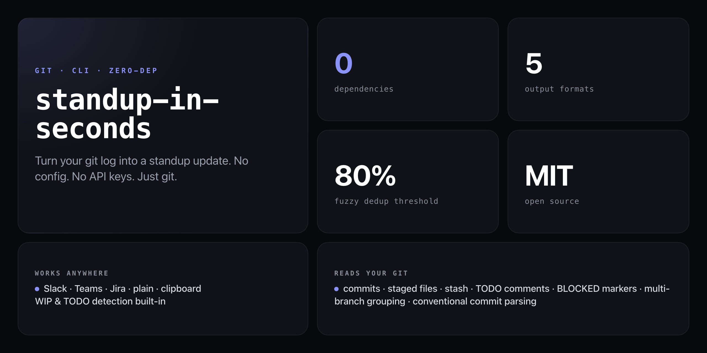

<div align="center">

**Your standup is in your git log. Stop pretending it isn't.**


</div>

---

`standup-in-seconds` reads your git log, detects WIP from `git status`, scans for TODO comments, deduplicates similar commits, and formats everything for wherever your standup lives — in under a second.

```
Yesterday
- Fixed auth token expiry in login flow
- Refactored user service to use dependency injection

Today
- Continuing work on feature/rate-limiting
- In progress: src/middleware/rateLimit.js

Blockers
- None

// Generated from 2 commits on feature/rate-limiting branch in myproject by Jane Doe
```

## Install

Not on npm — runs straight from GitHub with zero dependencies:

```bash
npx github:NickCirv/standup-in-seconds
```

## Usage

```bash
# default plain text standup
npx github:NickCirv/standup-in-seconds

# Slack format, copy to clipboard
npx github:NickCirv/standup-in-seconds --format slack --clipboard

# look back 3 days
npx github:NickCirv/standup-in-seconds --since "3 days ago"

# another author's standup
npx github:NickCirv/standup-in-seconds --author "Jane Doe"

# Jira wiki markup
npx github:NickCirv/standup-in-seconds --format jira
```

| Flag | Description |
|------|-------------|
| `--format <name>` | Output format: `slack` \| `teams` \| `plain` \| `jira` \| `clipboard` (default: `plain`) |
| `--since <date>` | git date syntax, e.g. `"3 days ago"`, `"2024-01-01"` (default: `"24 hours ago"`) |
| `--author <name>` | Filter by author name (default: your `git config user.name`) |
| `--clipboard` | Copy output to clipboard (`pbcopy` on macOS, `xclip`/`xsel` on Linux) |
| `--help` | Show help |

## Output formats

### Slack (`--format slack`)
```
*Yesterday*
• Fixed auth token expiry in login flow
• Refactored user service to use dependency injection

*Today*
• Continuing work on feature/rate-limiting
• In progress: src/middleware/rateLimit.js

*Blockers*
• None
```

### Microsoft Teams (`--format teams`)
```
**Yesterday**
1. Fixed auth token expiry in login flow
2. Refactored user service to use dependency injection

**Today**
1. Continuing work on feature/rate-limiting

**Blockers**
1. None
```

### Jira (`--format jira`)
```
*Yesterday*
* Fixed auth token expiry in login flow
* Refactored user service to use dependency injection

*Today*
* Continuing work on feature/rate-limiting

*Blockers*
* None
----
// Generated from 2 commits on feature/rate-limiting branch in myproject by Jane Doe
```

## How it works

**Yesterday section — git log**
- Reads `git log --since="24 hours ago"` filtered to your author
- Falls back to `--since="2 days ago"` automatically if nothing found
- Parses conventional commit prefixes (`feat:`, `fix:`, `refactor:`, `docs:`, etc.) into human-readable verbs
- Deduplicates similar messages using 80% fuzzy similarity — so `fix: auth` and `fix auth bug` merge into one
- Groups multi-branch work when commits span multiple branches

**Today section — WIP detection**
- `git status --porcelain` for staged and modified files (filters out `node_modules`, lock files, map files)
- `git stash list` for stashed work
- Scans recently changed files for `TODO:` comments and `BLOCKED:` markers

## Conventional commit mapping

| Prefix | Output verb |
|--------|-------------|
| `feat:` | Built |
| `fix:` | Fixed |
| `refactor:` | Refactored |
| `docs:` | Updated docs for |
| `test:` | Added tests for |
| `chore:` | Maintenance: |
| `perf:` | Improved performance of |

No prefix? The commit message is used as-is (capitalised).

## Edge cases handled

- **No commits found**: outputs a friendly message rather than an empty section
- **Not a git repo**: clear error with instructions
- **Multiple branches**: groups work across branches with a note
- **Duplicate commits**: merges near-identical messages with a count (`x2`, `x3`)
- **Windows clipboard**: falls back to `clip` automatically

## What it is NOT

- **Not an AI standup generator.** No LLMs, no API keys, no cloud calls — it reads your commits, not your mind.
- **Not a config file tool.** There is no `.standuprc`. If your commits describe your work, this tool works. If they don't, this tool will show you exactly that.
- **Not a project management integration.** It formats text for Slack/Teams/Jira — it does not post to those tools or read from them.

---

<div align="center">
<sub>Zero dependencies · Node 18+ · MIT · by <a href="https://github.com/NickCirv">NickCirv</a></sub>
</div>
